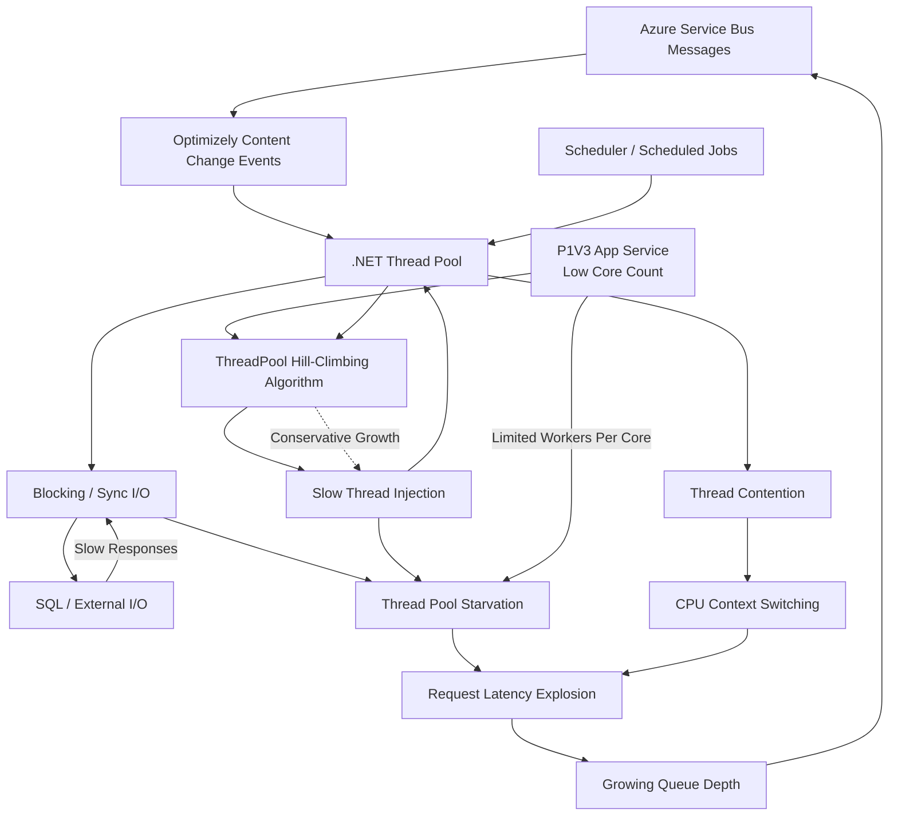

# Optimizely Platform Performance

This document outlines key performance considerations when operating the Optimizely (Episerver) CMS platform, with a focus on how infrastructure topology, threading behavior, and event-driven workloads interact in production environments.

## 1. Scheduler Instances and the Service Bus on Production Renderers

A common production topology runs the Optimizely renderer (the public-facing web app) alongside scheduled jobs and Azure Service Bus subscribers in the same process — or co-located on small App Service plans. On low-core SKUs such as **P1V3**, this combination can trigger a feedback loop that degrades request latency well before CPU saturation is visible in metrics.

### Failure mode at a glance



### Key architectural idea

- **Shared thread pool consumers.** Service Bus event handlers and scheduled jobs both consume .NET ThreadPool workers — the same pool that serves incoming HTTP requests.
- **Synchronous and blocking work is everywhere.** Optimizely workloads frequently include blocking operations that hold a worker thread for the full duration of an I/O call:
  - SQL queries against the CMS and Commerce databases
  - Cache locks and synchronous cache hydration
  - Content hydration and projection
  - Event pipeline handlers (content change events, publish/unpublish, etc.)
- **Low-core App Service plans amplify the problem.** On a small SKU like P1V3, the number of cores — and therefore the initial pool size — is small. There are simply fewer workers available before contention starts.
- **Hill-climbing injects threads slowly by design.** The .NET ThreadPool hill-climbing algorithm grows the worker count gradually (roughly one thread per ~500 ms once the minimum is exceeded) to avoid overshooting and oscillation. This is the correct long-term behavior, but it is unhelpful during sudden bursts.
- **During a burst, blocked threads outpace injection.** Service Bus message spikes, content publishes, or scheduler kick-offs create a wave of blocking work. Threads block on SQL or cache I/O faster than hill-climbing injects replacements, so:
  - the work queue depth grows
  - request latency climbs
  - the pool reaches starvation
- **Contention compounds the cost.** As more threads exist and contend for limited cores, context switching increases and effective throughput per thread drops — making the recovery curve even shallower.
- **The feedback loop is self-reinforcing.** Higher latency means slower message acknowledgement, which means deeper Service Bus queues, which means a larger burst when the system catches up. The site appears "slow everywhere" while CPU utilization can look deceptively moderate (60–75%), because the bottleneck is thread availability, not CPU.

### Practical implication

Co-locating Service Bus subscribers and scheduled jobs on a small renderer instance is a latency anti-pattern. Separating scheduler/event workloads onto a dedicated App Service plan (or scaling cores so hill-climbing has more headroom) breaks the feedback loop and keeps the renderer responsive under load.

## 2. The Optimizely Caching Model and Memory Pressure

Optimizely's performance story is built on aggressive in-process caching. The CMS treats the object cache as the primary read path: content items, properties, child listings, permissions, URL segments, route data, and resolved media are all hydrated into managed memory and held there until evicted. This is what makes the platform fast under steady-state load — but the same model is what causes memory pressure to dominate the failure modes on smaller instances, especially when scheduled jobs are involved.

### How the cache is populated

There are three populations paths, and all three converge on the same `ISynchronizedObjectInstanceCache` (backed by `MemoryCache` / `IMemoryCache`):

1. **Lazy / on-demand** — a request hits a content reference, the loader pulls it from SQL, projects it into the typed content model, and inserts it into the cache with a master key (`EPiServer:ContentCache`) and a set of dependency keys (parent, language branch, version, etc.).
2. **Eager / warmup** — on app start, on cache miss bursts, and during certain background operations, the platform pulls *related* content alongside the requested item. A single `GetChildren` can hydrate dozens of full content instances, each with their own property bags, blocks, and language variants.
3. **Event-driven invalidation + reload** — on a publish, the remote event arrives via the Service Bus, the dependency key is invalidated across all instances, and the next read re-hydrates the object graph. On a busy editorial site this happens continuously.

### Why "eager" hurts small instances

The eager path is the dangerous one on lower SKUs. Several behaviors compound:

- **Object graphs are large.** A single PageData / BlockData instance is not a row — it is a fully materialized .NET object with strongly-typed properties, ContentArea references, XhtmlString objects (which themselves cache parsed fragments), and lazy-load proxies. A "small" page can occupy 50–200 KB of managed heap once hydrated; a content-heavy landing page with nested blocks can exceed 1 MB.
- **Language branches multiply the footprint.** Each enabled language variant is cached as a separate instance. A site with 6 active languages caches 6 copies of every hydrated page.
- **Version and permission metadata tag along.** ACL entries, version metadata, and route segments are cached alongside the content, often with their own sliding expirations.
- **The cache has no hard upper bound by default.** `MemoryCache` uses a percentage of available physical memory as its ceiling. On a P1V3 (8 GB) instance running a 64-bit worker, that ceiling sounds generous — until you remember that the GC's working set, the request pipeline, Service Bus buffers, and the renderer's own per-request allocations all share that same budget.
- **Eviction is reactive, not proactive.** The cache only trims when memory pressure is *already* high. By the time eviction runs, Gen 2 GC is also running, and Gen 2 collections on a multi-GB heap are stop-the-world events that block every request thread.

### How scheduled jobs turn cache pressure into an outage

Scheduled jobs are the most common trigger for catastrophic memory pressure on the renderer, because most non-trivial jobs walk the content tree and force hydration of items that would never normally be in the hot set:

- **Content migration / fixup jobs** load every page or every instance of a given type — pulling cold content into the cache that immediately competes with the hot working set.
- **Search / index rebuild jobs** (Find, Search & Navigation, custom indexers) iterate the full content repository, hydrating each item to extract searchable fields. The cache fills with content that will never be served to a visitor.
- **Link validation, sitemap, and export jobs** do the same, often with the added cost of resolving every URL and media reference.
- **Scheduled imports** allocate large transient object graphs that promote to Gen 2 before the job completes.

On a co-located topology (renderer + scheduler in the same process or same App Service plan), the effect is direct:

```
Job starts
   ↓
Job iterates content → forces hydration of cold items
   ↓
MemoryCache grows past comfortable working set
   ↓
GC pressure rises → Gen 2 collections become frequent
   ↓
Stop-the-world pauses block request threads
   ↓
Request latency spikes → thread pool fills (see Section 1)
   ↓
MemoryCache triggers reactive eviction → evicts hot items too
   ↓
Post-job cache miss storm → SQL load spikes → re-hydration burst
   ↓
Renderer is degraded for minutes *after* the job has finished
```

The post-job recovery is often worse than the job itself, because the eviction was indiscriminate: the hot pages that were serving 90% of traffic got pushed out alongside the cold ones the job pulled in, and now every request is a cache miss against a database that is already under load.

### What "deceptively moderate" looks like here

Just like the thread-pool story in Section 1, the symptoms are misleading:

- **CPU** looks fine — the work is allocation and GC, not compute.
- **Working set** climbs steadily, then plateaus near the cache ceiling — which looks "normal" because that is what caches are supposed to do.
- **Private bytes / Gen 2 heap size** is the real signal, and it is rarely on the default dashboard.
- **% Time in GC** is the smoking gun. Anything sustained above ~20% means the renderer is spending one request in five waiting for the GC instead of serving users.

### Practical implications

- **Do not run content-walking jobs on the renderer instance.** This is the same separation argument as Section 1, but driven by memory rather than threads. A dedicated scheduler instance with its own cache and its own GC budget contains the blast radius.
- **Cap or shape the cache explicitly on small SKUs.** Configure `cacheMemoryLimitMegabytes` / `physicalMemoryLimitPercentage` on `MemoryCache` so eviction starts *before* GC pressure does, rather than after.
- **Avoid `GetChildren` / `GetDescendents` in jobs.** Stream content references and load on demand with bounded batches; release references between batches so the GC can actually reclaim.
- **Watch language branches.** If a job only needs the master language, load it explicitly — do not let the default loader pull every variant into the cache.
- **Pre-warm deliberately, not accidentally.** A scripted warmup of the known hot set after deploy is cheap insurance; an accidental warmup of the entire repository via a fixup job is an outage.
